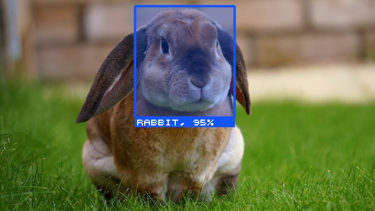

<h3 align="center">
    <b>P O T L O T</b>
</h3>

<p align="center">

</p>

A single-file header only library for simple drawing and image manipulation in pure C.
It has basic shape drawing function (circle, rectangle, lines), built-in pixel font, basic image processing (blur, median filter, etc) and STB image interoperability (optional).
My main purpose is to use this as the complimentary for [mint](https://github.com/ariaghora/mint) library to give image annotations.

```C
#define POTLOT_IMPLEMENTATION
#include "potlot.h"

#define STB_IMAGE_IMPLEMENTATION
#include "stb_image.h"

int main(void) {
  int img_width;
  int img_height;
  int img_channels;
  unsigned char *img_stbi = stbi_load("rabbit.jpg", &img_width,
                                      &img_height, &img_channels, 0);

  plt_image *img = plt_from_stbi_uc_rgb(img_stbi, img_width, img_height);
  plt_rect_fill(img, 230, 10, 400, 200, 0x1155ff, 0.3);
  plt_rect_draw(img, 230, 10, 400, 200, 0x1155ff, 4);
  plt_rect_fill(img, 230, 200, 400, 216, 0x1155ff, 1);
  plt_text_draw_scaled(img, "rabbit, 95%", 234, 204, 0xffffff, 2);

  plt_save_ppm(img, "rabbit_annotated.ppm");

  plt_free(img);
  stbi_image_free(img_stbi);
}

```